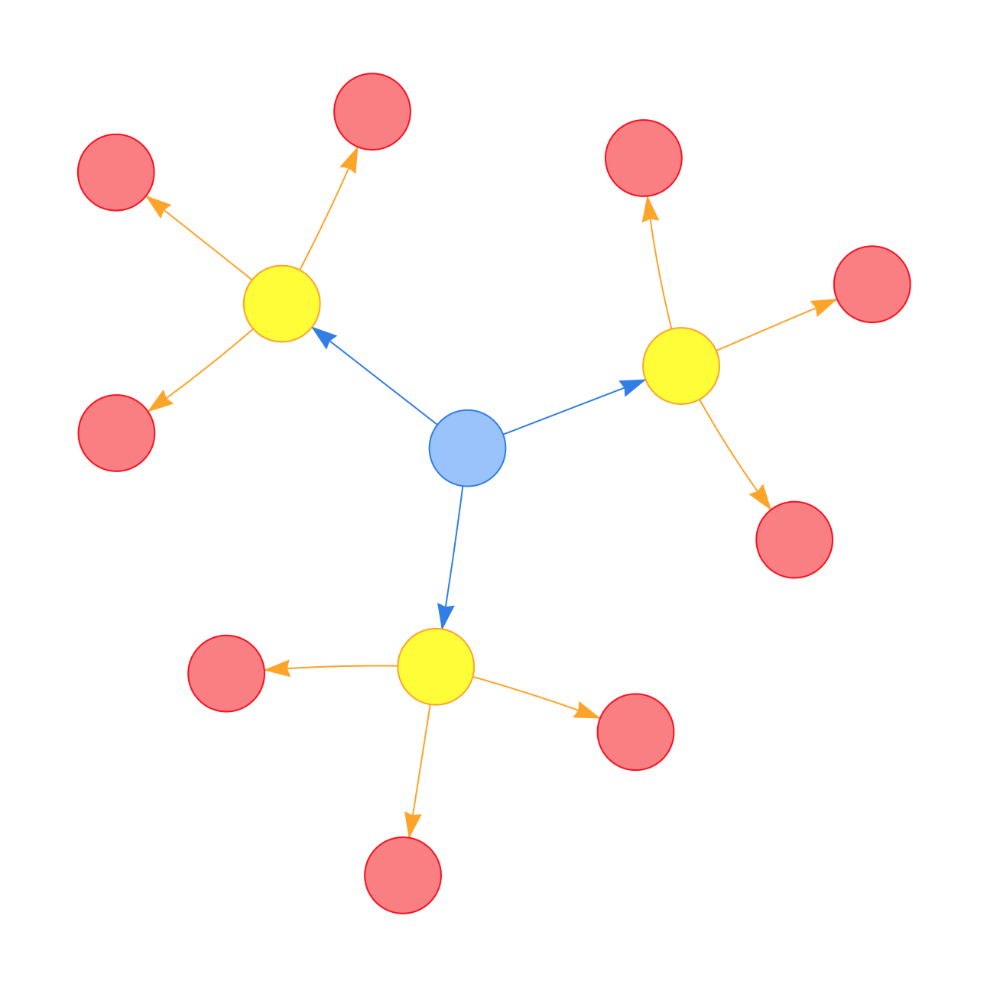

## The Dependancy graph

```
We can model a job structure as a directed dependancy graph. 
Each job in our system can be modelled as a node. Each dependancy between two jobs can be modelled as a directed edge from one job to another. We call the job a that depends on another job b as the child of b. The dependancy edge can either be from parent->child(b->a) or child->parent(a->b). Since parent->child edges are more intuitive, we select that format.

Lets take an example from the given challenge

Job structure:

a =>
b => c
c => f
d => a
e => b
f =>

This job structure is represented as the following dependancy graph


```

```
Given you’re passed an empty string (no jobs), the result should be an empty sequence.
```
```
Given the following job structure:

a =>

The result should be a sequence consisting of a single job a.
```
```
Given the following job structure:

a =>
b =>
c =>

The result should be a sequence containing all three jobs abc in no significant order.
```
```
Given the following job structure:

a =>
b => c
c =>

The result should be a sequence that positions c before b, containing all three jobs abc.
```
```
Given the following job structure:


a =>
b => c
c => f
d => a
e => b
f =>

The result should be a sequence that positions f before c, c before b, b before e and a before d containing all six jobs abcdef.
```
```
Given the following job structure:

a =>
b =>
c => c

The result should be an error stating that jobs can’t depend on themselves.
```
```
Given the following job structure:

a =>
b => c
c => f
d => a
e =>
f => b

The result should be an error stating that jobs can’t have circular dependencies.
```

## To run the code(Linux)
```
compile the code :  javac job_sequencer.java 
run the code : java job_sequencer
```

